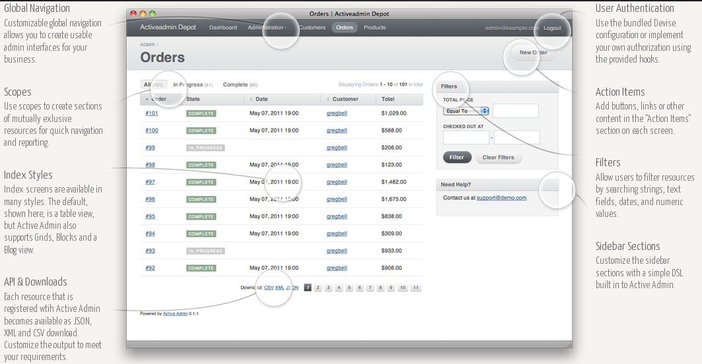

!SLIDE bullets
# Capistrano

* [capistranorb.com][cap]
* Deployment recipes: [deprec.org][deprec]

[cap]: http://capistranorb.com
[deprec]: http://deprec.org

!SLIDE commandline incremental
# cap

    $ capify
    $ cap deprec:rack:install_stack
    $ cap production deploy

!SLIDE
# deploy.rb

    @@@ruby
    set :deploy_to, "/var/www/foo"
    set :rails_env, "production"

    server "foobar@example.com", :app, :web, 
      :db, :primary => true

    task :package_assets, :roles => :web do
      run "./script/package_assets.sh"
    end

!SLIDE bullets
# Chef

* [opscode.com/chef][chef]

[chef]: http://www.opscode.com/chef

!SLIDE bullets
# Devise + OmniAuth

* [platformatec/devise @ github][devise]
* [intridea/omniauth @ github][omniauth]

[devise]: http://github.com/platformatec/devise
[omniauth]: http://github.com/intridea/omniauth

!SLIDE commandline incremental
# Devise

    $ rails generate devise:install
    $ rails generate devise User

!SLIDE
# Devise modules

* Database Authenticable
* Token Authenticable
* Omniauthable
* Confirmable
* Recoverable
* Registerable

!SLIDE
# More Devise modules

* Rememberable
* Trackable
* Timeoutable
* Validatable
* Lockable
* Encryptable

!SLIDE bullets
# InheritedResources

* [josevalim/inherited_resources @ github][inherited_resources]

[inherited_resources]: http://github.com/josevalim/inherited_resources

!SLIDE
# InheritedResources

    @@@ruby
    class ReviewsController < 
      InheritedResources::Base
      
      belongs_to :product
      actions :index, :new, :create
      has_scope :rating
      
      def create
        create! { collection_url }
      end
    end

!SLIDE bullets
# ActiveAdmin

* [activeadmin.info][active_admin]

[active_admin]: http://activeadmin.info

!SLIDE center

!SLIDE commandline incremental
# Active Admin

    $ rails generate active_admin:install
    $ rails generate active_admin:resource product

!SLIDE
# Active Admin

    @@@ruby
    ActiveAdmin.register Product do
      scope :unreleased
      
      index do
        column :name
        column "Release Date", :released_at
        column :price, :sortable => :price do |product|
          div :class => "price" do
            number_to_currency product.price
          end
        end
        default_actions
      end
    end

!SLIDE bullets
# RSpec 

* [relishapp.com/rspec][rspec]

[rspec]: http://www.relishapp.com/rspec

!SLIDE
# RSpec 

    @@@ruby
    describe Stack do
      let(:stack) { Stack.new }
      subject { stack }

      context "initially" do
        it { should be_empty }
      end

      context "after push" do
        before { stack.push(:foo) }

        it { should_not be_empty }
      end
    end

!SLIDE commandline incremental
# RSpec 

    $ rspec --format documentation stack_spec.rb

    Stack
      initially
        should be empty
      after push
        should not be empty

    Finished in 0.42198 seconds
    2 examples, 0 failures

!SLIDE bullets
# FactoryGirl 

* [thoughtbot/factory_girl @ github][factory_girl]

[factory_girl]: http://github.com/thoughtbot/factory_girl

!SLIDE
# FactoryGirl 

    @@@ruby
    FactoryGirl.define do
      factory :user do
        sequence(:email) { |n| 
          "email#{n}@factory.com" }

        password "foobar"
        password_confirmation "foobar"
      end
    end

!SLIDE
# FactoryGirl 

    @@@ruby
    Factory(:user, 
      :email => 'other@email.com')
    Factory.build(:user)
    Factory.attributes_for(:user)
    Factory.stub(:user)

!SLIDE bullets
# Capybara

* [jnicklas/capybara @ github][capybara]

[capybara]: http://github.com/jnicklas/capybara

!SLIDE
# Capybara 

    @@@ruby
    visit('/login')
    within("#session") do
      fill_in 'Login', :with => email
      fill_in 'Password', :with => password
    end
    click_link 'Sign in'

    page.should have_content('Welcome')

!SLIDE bullets
# Cucumber

* [cukes.info][cucumber]

[cucumber]: http://cukes.info

!SLIDE
# Cucumber

    # language: en
    Feature: Division
      In order to avoid silly mistakes
      Cashiers must be able to calculate 
        a fraction

      Scenario: Regular numbers
        * I have entered 3 into the calculator
        * I have entered 2 into the calculator
        * I press divide
        * the result should be 1.5 on 
          the screen

!SLIDE
# Cucumber PL

    # language: pl
    Właściwość: Dzielenie
      W celu uniknięcia głupich błędów
      Kasjer musi znać się na ułamkach

      Scenariusz: Zwykłe liczby
        Zakładając wprowadzenie do kalkulatora 
          liczby 3
        Oraz wprowadzenie do kalkulatora 
          liczby 2
        Jeżeli nacisnę podziel
        Wtedy rezultat 1.5 wyświetli się 
          na ekranie

!SLIDE
# Cucumber steps

    Given /I have entered (\d+) into the calculator/ do |n|
      @calc.push n.to_i
    end

    When /I press (\w+)/ do |op|
      @result = @calc.send op
    end

    Then /the result should be (.*) on the screen/ do |result|
      @result.should == result.to_f
    end

!SLIDE center
# CoffeeScript

!SLIDE
# CoffeeScript

    @@@coffeescript
    CreditCard =
      cleanNumber: (number) -> number.replace /[- ]/g, ""
      
      validNumber: (number) ->
        total = 0
        number = @cleanNumber(number)
        for i in [(number.length-1)..0]
          n = +number[i]
          if (i+number.length) % 2 == 0
            n = if n*2 > 9 then n*2 - 9 else n*2
          total += n
        total % 10 == 0

!SLIDE
# CoffeeScript

    @@@coffeescript
    jQuery ->
      $("#order_credit_card_number").blur ->
        if CreditCard.validNumber(@value)
          $("#credit_card_number_error")
            .text("")
        else
          $("#credit_card_number_error")
            .text("Invalid credit card number.")

!SLIDE bullets
# SASS (SCSS)

* [sass-lang.com][sass]

[sass]: http://sass-lang.com

!SLIDE
# SASS (SCSS)

    @@@css
    @mixin rounded($radius: 0.5em) {
      -webkit-border-radius: $radius; 
      -moz-border-radius: $radius;
      border-radius: $radius;
    }

    .flash {
      @include rounded(10px);
    }

!SLIDE bullets
# So many more...

* [ruby-toolbox.com][rtoolbox]

[rtoolbox]: http://ruby-toolbox.com

!SLIDE
# Q/A

!SLIDE
# Thank you :)
