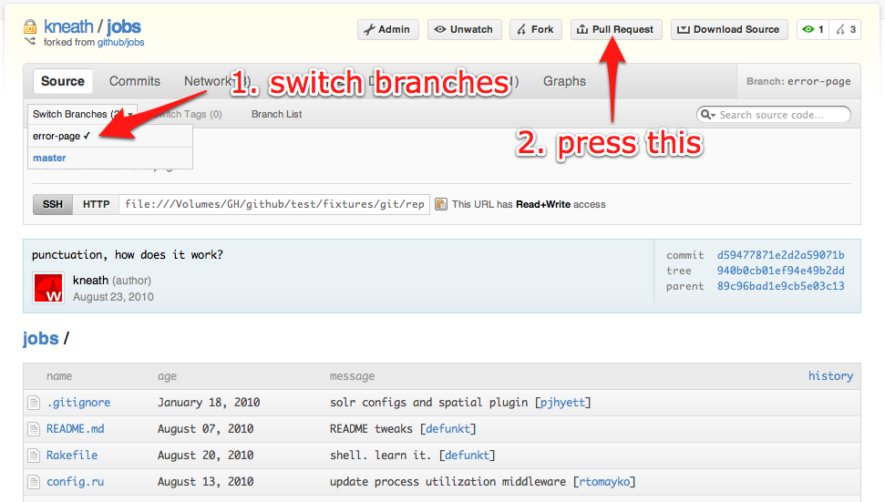
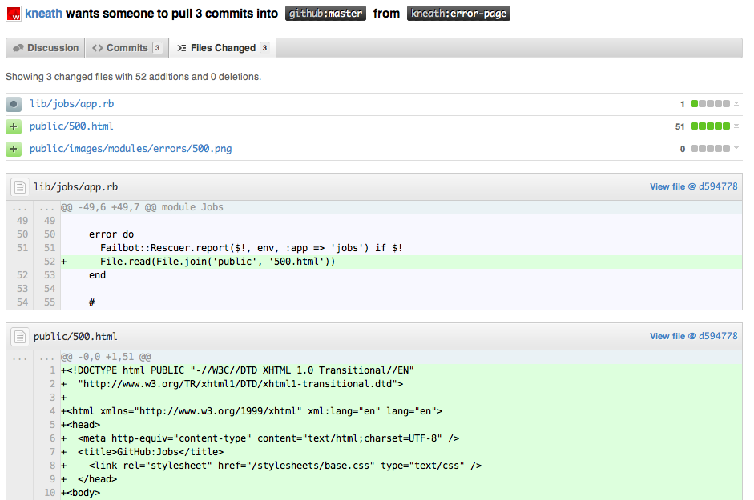

!SLIDE
# Tools

!SLIDE bullets
# RVM

* [beginrescueend.com][rvm]

[rvm]: http://beginrescueend.com/

!SLIDE bullets incremental
# Ruby VMs

* MRI 1.8.x
* MRI 1.9.x
* JRuby
* Rubinius
* IronRuby
* ...

!SLIDE commandline incremental
# RVM

    $ rvm install 1.9.2
    $ echo "rvm 1.9.2@my-app" >> .rvmrc
    $ rvm jruby
    $ rvm 1.8.7,1.9.2 exec rspec spec/foo_spec.rb

!SLIDE bullets
# Bundler

* [gembundler.com][bundler]

[bundler]: http://gembundler.com

!SLIDE commandline incremental
# Bundler

    $ bundle [install]
    $ bundle update
    $ bundle gem

!SLIDE
# Gemfile

    @@@ruby
    source :rubygems

    gem "sinatra"
    gem "rspec", ">=2.6"

!SLIDE
# Git

!SLIDE bullets incremental
# GitHub

* open source
* made AWESOME

!SLIDE center

!SLIDE center

!SLIDE center

